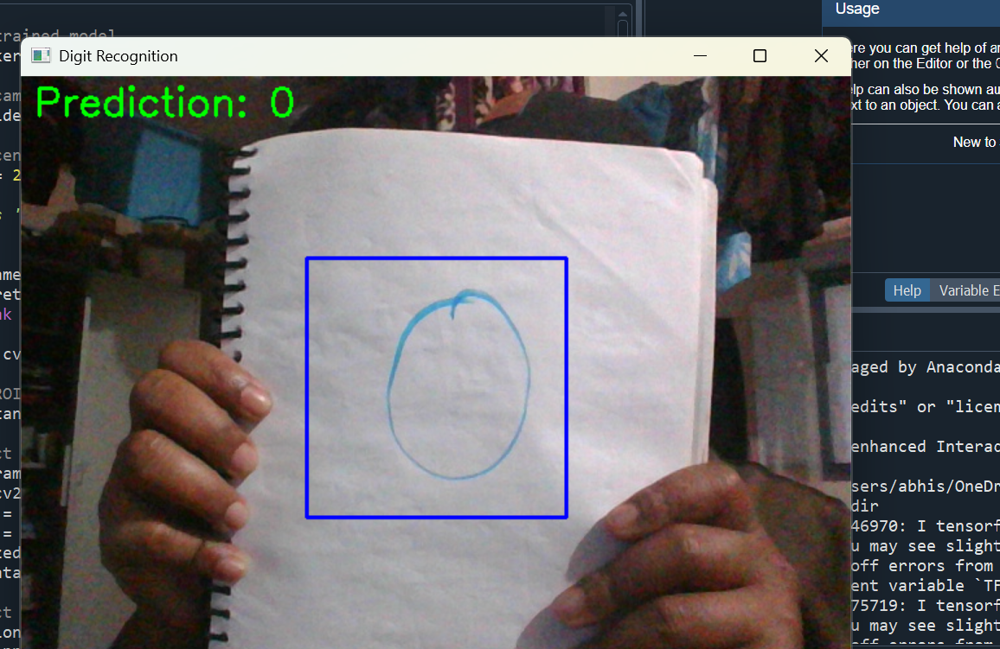

# 🧠 Real-Time Handwritten Digit Classification using CNN & Webcam

This project implements a Convolutional Neural Network (CNN) to classify handwritten digits using the MNIST dataset. It also enables **real-time digit recognition** using your webcam via OpenCV.

---

## 📂 Project Structure

```
├── cnn_model.h5              # Trained CNN model
├── main.py                   # Real-time webcam inference script
├── train_model.ipynb         # Model training notebook
├── requirements.txt          # Python package dependencies
├── README.md                 # Project overview and instructions
├── 0.png, 2.png              # Sample prediction screenshots
```

---

## 📦 Requirements

Install dependencies using:

```bash
pip install -r requirements.txt
```

Or install them manually:

```bash
pip install tensorflow opencv-python matplotlib numpy
```

---

## 🧠 Model Summary

- **Dataset:** MNIST (Handwritten Digits)
- **Architecture:**
  - Conv2D (32 filters, 3x3, ReLU)
  - MaxPooling2D (2x2)
  - Conv2D (64 filters, 3x3, ReLU)
  - MaxPooling2D (2x2)
  - Flatten
  - Dense (64 units, ReLU)
  - Dense (10 units, Softmax)
- **Loss:** Sparse Categorical Crossentropy
- **Optimizer:** Adam
- **Epochs:** 5

---

## 🚀 How to Run

### 📌 Train the Model (Optional)

```bash
Open train_model.ipynb in Jupyter Notebook and run all cells.
```

This will generate `cnn_model.h5`.

### 📌 Run Real-Time Inference

```bash
python main.py
```

- A webcam window will open.
- Hold a digit inside the blue box on paper.
- It will predict and display the digit in real-time.
- Press `q` to quit.

---

## 📷 Screenshots




---

## 🛠 Tech Stack

- Python
- TensorFlow/Keras
- OpenCV
- NumPy
- Jupyter Notebook
- Matplotlib

---

## 👨‍💻 Author

**Abhishek**  
B.Tech CSE — Real-Time ML Assignment 2025  
GitHub: [your-github-username]  
Email: [your-email@example.com]

---

## 📄 License

This project is open-source and free to use for learning and personal use.
